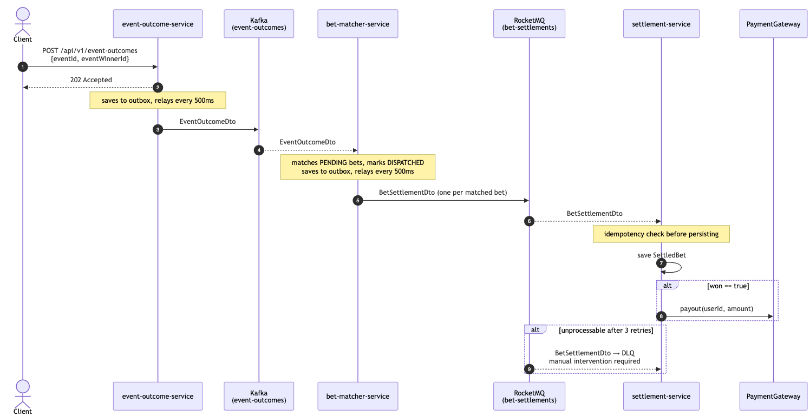

# Functional Requirements

## Core
- Publish sports event outcome
- Match sports event outcome → bet
- Settle bets

## Out of Scope / Below the Line
- Create event (admin)
- Create bet (user)
- View settlement status (user)
- The assignment outcome message only provides EventWinnerId, therefore only winner-type markets are considered settleable. EventMarketId is stored for extensibility but not used to drive different settlement rules.

---

# Non-Functional Requirements

## Scale
- 10M DAU
- Bets → 100M bets/day
- Events → ~1000/sec
- Settlements → 100M/day

## Latency
- Place bet → < 100 ms
- Settlement → < 5 min

## Consistency / CAP
- Settlement → Eventual consistency → prioritize A (as opposed to place bet → Strong consistency → prioritize C)

## Durability / Compliance
- Retain bets for 5 years

## Out of Scope / Below the Line
- Authentication / authorization
- Cloud orchestration, deployment pipelines, infrastructure
    - Kubernetes
    - API Gateway
    - Infrastructure setup
- Tests (best effort due to time constraints)
- Observability

---

# Entities

- `SportEvent`
- `Bet`
- `Settlement`

---

# APIs

## Publish Event Outcome

`POST /api/v1/event-outcomes`

Request:

```json
{
  "eventId": 1,
  "eventName": "Champions League Final",
  "eventWinnerId": 123
}
```

Responses:

- `200` → ingested
- `404` → event not found
- `409` → event already ingested

---

# High-Level Design

HLD


Sequence diagram



---

# Deep Dives

### Scalability — Hot Event Problem

The current implementation processes all bets for an event sequentially in a single consumer thread.

For a hot event with millions of bets, this becomes a bottleneck.

### Root Cause

A single consumer thread processes all bets for one event end-to-end.

Result:

- Parallelism is limited
- Hot events become bottlenecks

---

### Proposed Solution: Kafka-Based Fan-Out

Make `bet-matcher` a coordinator.

#### 1. Coordinator

Consumes from `event-outcomes`.

Responsibilities:

- Execute lightweight `MIN/MAX(betId)` query
- Split the range into `N` chunks
- Publish chunk messages to a new `bet-chunks` topic

Characteristics:

- Returns immediately
- No heavy DB processing
- No timeout risk

---

#### 2. Workers

Consume from `bet-chunks`.

Responsibilities:

Receive:

```json
{
  "eventId": "...",
  "winnerId": "...",
  "minBetId": "...",
  "maxBetId": "..."
}
```

Each worker:

- Queries its own non-overlapping `betId` range
- Publishes `BetSettlementDto` messages to RocketMQ
- Executes work in independent transactions

---

#### 3. Settlement Service

Remains unchanged.

Already horizontally scalable as a RocketMQ consumer group.

---

### Database

A distributed relational database is appropriate:

- CockroachDB
- Aurora PostgreSQL

`betId` ranges naturally partition the data.

Benefits:

- Non-overlapping reads
- No locking conflicts
- Minimal contention

---

### Result

Processing time for a hot event changes from:

```text
O(total bets)
```

to:

```text
O(total bets / N)
```

Performance becomes bounded primarily by:

- Database throughput
- RocketMQ publish rate

---

### Deployment Strategy

Three independent deployments:

#### Coordinator

- Lightweight
- Minimal instance count
- Optimized for fast chunk creation

Scale conservatively.

---

#### Workers

Heavy processing component.

Scale based on:

- Bet volume
- Kafka `bet-chunks` lag

---

#### Settlement Service

Scale based on:

- RocketMQ queue depth

---

### Auto-Scaling Metrics

| Component | Scaling Metric |
|------------|----------------|
| Coordinator | CPU / Kafka lag (`event-outcomes`) |
| Workers | Kafka lag (`bet-chunks`) |
| Settlement | RocketMQ queue depth |

---

### Alternative Approach: lookup in settlement service

Move lookup logic into settlement service.

Benefits:

- Existing parallelization through RocketMQ consumers

Drawbacks:

- Blurs service boundaries
- Settlement service becomes responsible for bet lookup

---

### Parallelisation in a single consumer

Parallelize lookup in consumer (e.g. with parallel streams).

Benefits:

- Easier implementation

Drawbacks:

- Scale -> limited

---

# Prevent Duplicate Processing

End-to-end idempotency is required to prevent duplicate processing and double-booking.

---

## Idempotency Keys

The key depends on operation scope.

### Event Outcome Service

Use:

```text
eventId
```

Reason:

- Event outcomes should be processed only once

### Settlement Service

Use:

```text
betId
```

Reason:

- One event maps to many bets
- Each settlement must be independently idempotent

---

## API-Level Protection

On request receipt:

1. Check whether the event was already processed
2. Stop processing immediately if found

---

## Kafka Producer

Configuration:

```properties
enable.idempotence=true
```

Purpose:

- Prevent duplicate publications caused by retries

---

## Kafka Consumer

Consumer idempotency is implemented in application logic.

Rules:

- Process only bets in `PENDING` state
- Skip terminal states

Use:

- Optimistic locking

Purpose:

- Prevent contention
- Prevent duplicate processing

---

## Reliable Messaging

Use the Outbox pattern.

Business updates and outbox records are persisted in the same transaction.

Flow:

```text
Business transaction
        ↓
Persist domain changes
        +
Persist outbox record
        ↓
Commit transaction
        ↓
Scheduled publisher
        ↓
RocketMQ
```

Benefits:

- Prevents dual-write inconsistencies
- Guarantees eventual delivery

---

## Settlement Consumer Protection

The RocketMQ consumer:

- Checks whether a bet has already been settled
- Skips processing if the bet is already in a terminal state

---

## External Payment Idempotency

Propagate:

```text
betId
```

as the idempotency key to the external payment provider.

Requirement:

- Verify provider-side support for idempotency keys

Purpose:

- Prevent duplicate payouts