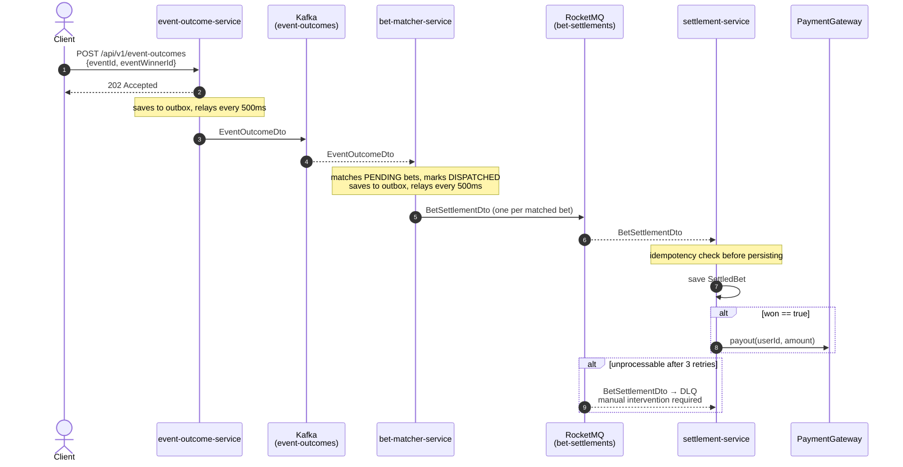

```mermaid
sequenceDiagram
    autonumber
    actor Client

    participant EOS as event-outcome-service
    participant Kafka as Kafka<br/>(event-outcomes)
    participant BMS as bet-matcher-service
    participant RMQ as RocketMQ<br/>(bet-settlements)
    participant SS as settlement-service
    participant PG as PaymentGateway

    Client->>EOS: POST /api/v1/event-outcomes<br/>{eventId, eventWinnerId}
    EOS-->>Client: 202 Accepted

    note over EOS: saves to outbox, relays every 500ms
    EOS->>Kafka: EventOutcomeDto

    Kafka-->>BMS: EventOutcomeDto
    note over BMS: matches PENDING bets, marks DISPATCHED<br/>saves to outbox, relays every 500ms
    BMS->>RMQ: BetSettlementDto (one per matched bet)

    RMQ-->>SS: BetSettlementDto
    note over SS: idempotency check before persisting
    SS->>SS: save SettledBet

    alt won == true
        SS->>PG: payout(userId, amount)
    end

    alt unprocessable after 3 retries
        RMQ-->>SS: BetSettlementDto → DLQ<br/>manual intervention required
    end
```
